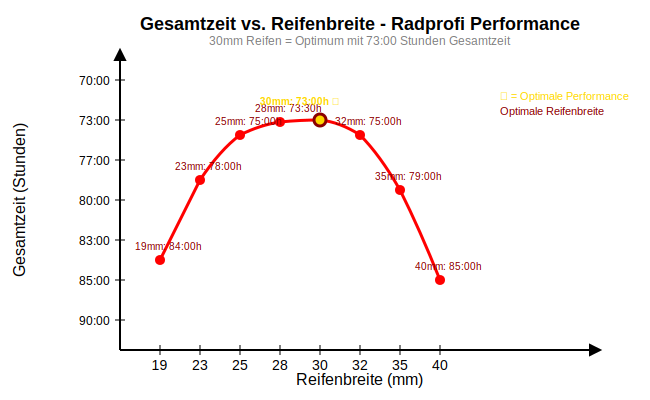

# bloggg

**<span style="color: orange;">Alle Lösungen, die hier unter github.com/hjstephan86 *als neue Lösungen* gezeigt werden, sind urheberrechtlich geschützt. Eine kommerzielle Nutzung ist ausgeschlossen. Eine freie Nutzung braucht meine Zustimmung.</span>**

Nachfolgend habe ich Gedanken aufgeschrieben, die ich in den Gedanken unter [https://github.com/hjstephan86/blog](https://github.com/hjstephan86/blog) und [https://github.com/hjstephan86/blogg](https://github.com/hjstephan86/blogg) nicht aufgeschrieben haben.

## Inhaltsverzeichnis

* [Python und Java](#python-und-java)
* [Code: Formatierung und Kommentare](#code-formatierung-und-kommentare)
* [Systemversagen in der Cybersecurity-Industrie](#systemversagen-in-der-cybersecurity-industrie)
* [Naturwissenschaft](#naturwissenschaft)
* [Notizen aus Vorlesungen](#notizen-aus-vorlesungen)
* [Verfolgung](#verfolgung)

## Python und Java

Die Struktur oder die Strukturen einer Software werden beschrieben durch Programmiersprachen wie Python oder HTML. Der Inhalt ist gegeben durch die Daten, die mit Hilfe der Strukturen verarbeitet und angezeigt werden. Wie hängen unterschiedliche **Verteilungen von Programmiersprachen** für die Strukturbeschreibungen zusammen mit der Menge von Daten einer Software? Sind besonders viele Daten zu verarbeiten, ist zu erwarten, dass bestimmte Programmiersprachen sich für diesen Zweck besser eignen. Auf [https://github.com/hjstephan86/pyble-app?tab=readme-ov-file#Language-Distribution](https://github.com/hjstephan86/pyble-app?tab=readme-ov-file#Language-Distribution) zeige ich beispielhaft die Verteilung der Programmiersprachen für pyble-app. Ein Skript zur Erstellung dieser Verteilung liegt in diesem Repository unter src/ldist.py. Welche Programmiersprache eignet sich dabei besonders unter den bekannten Sprachen wie Python oder Java? Verglichen werden Python und Java hinsichtlich des benötigten Speicherbedarfs **(RES)** auf [https://github.com/hjstephan86/pyble-app?tab=readme-ov-file#Compare-RES-of-Python-and-Java](https://github.com/hjstephan86/pyble-app?tab=readme-ov-file#Compare-RES-of-Python-and-Java). Eine andere Metrik zum Vergleich beider Sprachen ist die Anzahl der benötigten **Code-Zeilen**. Je mehr Code-Zeilen geschrieben werden müssen, desto größer ist der Aufwand für die Implementierung und für die Wartung.

Ich habe Quicksort in Python und Java implementiert, ausgeführt und dabei die Laufzeit und den Speicherbedarf gemessen. Die Quelldateien befinden sich in src/. Wie erwartet ist Java *nach* der Kompilierung in der Ausführung schneller als Python. Im benötigten Speicherbedarf (RES) wurde für den Java Prozess 185640 Byte (185,6 KB) und für den Python Prozess 185688 Byte (185,7 KB) gemessen. 

<pre>
Timestamp,PID,RES_KB,VSZ_KB,CPU%,Command
2025-08-05 05:34:33,  15412 102952 819940 109 /usr/bin/gnome-text-editor /home/stephan/java.res.txt
2025-08-05 05:34:34,  15412 185640 2195568 48.0 /usr/bin/gnome-text-editor /home/stephan/java.res.txt
2025-08-05 05:34:36,  15412 184852 2194748 28.8 /usr/bin/gnome-text-editor /home/stephan/java.res.txt
2025-08-05 05:34:37,  15412 184980 2194748 21.3 /usr/bin/gnome-text-editor /home/stephan/java.res.txt
2025-08-05 05:34:38,  15412 184980 2194748 17.0 /usr/bin/gnome-text-editor /home/stephan/java.res.txt
2025-08-05 05:34:39,  15412 184980 2194748 14.4 /usr/bin/gnome-text-editor /home/stephan/java.res.txt
2025-08-05 05:34:41,  15412 184980 2194748 12.6 /usr/bin/gnome-text-editor /home/stephan/java.res.txt
2025-08-05 05:34:42,  15412 184980 2194748 11.4 /usr/bin/gnome-text-editor /home/stephan/java.res.txt
2025-08-05 05:34:43,  15412 184980 2194748 10.3 /usr/bin/gnome-text-editor /home/stephan/java.res.txt
2025-08-05 05:34:45,  15412 184980 2194748 9.4 /usr/bin/gnome-text-editor /home/stephan/java.res.txt
2025-08-05 05:34:46,  15412 184980 2194748 8.6 /usr/bin/gnome-text-editor /home/stephan/java.res.txt
2025-08-05 05:34:47,  15412 184980 2194748 7.9 /usr/bin/gnome-text-editor /home/stephan/java.res.txt
2025-08-05 05:34:49,  15412 184980 2194748 7.5 /usr/bin/gnome-text-editor /home/stephan/java.res.txt
2025-08-05 05:34:50,  15412 184980 2194748 7.3 /usr/bin/gnome-text-editor /home/stephan/java.res.txt
2025-08-05 05:34:51,  15412 184980 2186552 6.9 /usr/bin/gnome-text-editor /home/stephan/java.res.txt
2025-08-05 05:34:53,  15412 184140 2161148 6.8 /usr/bin/gnome-text-editor /home/stephan/java.res.txt
</pre>

<pre>
Timestamp,PID,RES_KB,VSZ_KB,CPU%,Command
2025-08-05 05:34:55,  16250 183896 2069364 100 /usr/bin/gnome-text-editor /home/stephan/python3.res.txt
2025-08-05 05:34:56,  10600 19328  32264  0.0 /usr/bin/python3 /usr/bin/gnome-terminal --wait
2025-08-05 05:34:56,  16250 184536 2057396 50.2 /usr/bin/gnome-text-editor /home/stephan/python3.res.txt
2025-08-05 05:34:57,  10600 19328  32264  0.0 /usr/bin/python3 /usr/bin/gnome-terminal --wait
2025-08-05 05:34:57,  16250 184664 2057528 34.3 /usr/bin/gnome-text-editor /home/stephan/python3.res.txt
2025-08-05 05:34:59,  10600 19328  32264  0.0 /usr/bin/python3 /usr/bin/gnome-terminal --wait
2025-08-05 05:34:59,  16250 185048 2058056 27.2 /usr/bin/gnome-text-editor /home/stephan/python3.res.txt
2025-08-05 05:35:00,  10600 19328  32264  0.0 /usr/bin/python3 /usr/bin/gnome-terminal --wait
2025-08-05 05:35:00,  16250 185688 2058516 23.1 /usr/bin/gnome-text-editor /home/stephan/python3.res.txt
2025-08-05 05:35:01,  10600 19328  32264  0.0 /usr/bin/python3 /usr/bin/gnome-terminal --wait
2025-08-05 05:35:01,  16250 185688 2060564 23.1 /usr/bin/gnome-text-editor /home/stephan/python3.res.txt
</pre>

Mit `loc.py` habe ich die benötigten Code-Zeilen ermittelt. Das Skript befindet sich in diesem Repository unter src/loc.py.
<pre>
>> python3 loc.py QuickSort.java 
Language    Files    Blank    Comment    Code    Total
----------  -------  -------  ---------  ------  -------
Java        1        30       53         119     202
--------    -----    -----    -------    ----    -----
Total       1        30       53         119     202
</pre>

<pre>
>> python3 loc.py quicksort.py
Language    Files    Blank    Comment    Code    Total
----------  -------  -------  ---------  ------  -------
Python      1        43       48         101     192
--------    -----    -----    -------    ----    -----
Total       1        43       48         101     192
</pre>
Die Implementierung in Java erfordert 119 Code-Zeilen, die Python-Implementierung benötigt nur 101 Code-Zeilen. Dies resultiert in einer Codereduktion von 15,1% bei Verwendung von Python gegenüber Java. **Für größere Softwareprojekte ist Python in der Lesbarkeit, Implementierung und Wartbarkeit attraktiver als Java**. In der Wissenschaft hat sich Python durchgesetzt, da Python einfacher zu lernen ist als Java. 

## Code: Formatierung und Kommentare

Die Lesbarkeit von Code ist wichtig. Die Formatierung des Codes und Kommentare im Code helfen dabei. Das Skript `loc.py` in diesem Repository unter src/loc.py hilft dabei, die Formatierung im Code und das Generieren von Kommentaren im Code sicher durchzuführen. Dazu kann `loc.py` vor und nach der Formatierung und Generierung von Kommentaren ausgeführt und das Ergebnis beider Ausführungen verglichen werden.

Durchgeführt habe ich diesen Vorgang mit ldist.py unter src/ldist.py. Hier die Ausgabe von `loc.py` davor:
<pre>
>> python3 loc.py ldist.py 
Language    Files    Blank    Comment    Code    Total
----------  -------  -------  ---------  ------  -------
Python      1        42       73         268     383
--------    -----    -----    -------    ----    -----
Total       1        42       73         268     383
</pre>  

Hier die Ausgabe von `loc.py` danach:
<pre>
>> python3 loc.py ldist.py 
Language    Files    Blank    Comment    Code    Total
----------  -------  -------  ---------  ------  -------
Python      1        48       93         270     411
--------    -----    -----    -------    ----    -----
Total       1        48       93         270     411
</pre>
Im Code von `ldist.py` wurden nur zwei Zeilen mit der Formatierung hinzugefügt, da eine längere Anweisung automatisch umgebrochen wurde.  Insgesamt wurden 20 neue Zeilen für Kommentare generiert und sechs neue Leerzeilen für die Formatierung hinzugefügt.

## Systemversagen in der Cybersecurity-Industrie
### Die CVE-Krise als Symptom für strukturelle Probleme

*Basierend auf dem c't-Artikel "Trubel bei CVE - US-Schwachstellendatenbank drohte kurzzeitig die Abschaltung" (c't 12/2025) von Christopher Kunz*

---

### Einleitung

Der beinahe erfolgte Kollaps der CVE-Datenbank im April 2025 offenbarte nicht nur die Fragilität kritischer IT-Infrastrukturen, sondern auch systematische Interessenskonflikte in der Cybersecurity-Industrie. Die drohende Abschaltung der weltweit wichtigsten Schwachstellendatenbank wirft fundamentale Fragen über die Rollenverteilung zwischen Softwareherstellern, Security-Anbietern und Endnutzern auf.

### 1. Das inkonsequente Verhalten der Marktführer

#### Die CVE-Krise als Chance für Marktführer

Die im c't-Artikel beschriebene Beinahe-Abschaltung der CVE-Datenbank hätte für große Softwarehersteller durchaus vorteilhafte Nebeneffekte gehabt:

**Verschleierung wird einfacher:**
- Ohne einheitliche CVE-Kennungen können Sicherheitslücken schwerer kommuniziert werden
- Fragmentierte nationale oder regionale Datenbanken erschweren Vergleiche
- "Security by Obscurity" wird wieder zu einer realistischen Option

**Reduzierter öffentlicher Druck:**
- Weniger transparente Severity-Bewertungen
- Schwierigere Risikobewertung für Kunden
- Komplexere Medienberichterstattung über Sicherheitslücken

#### Das Paradox der Marktmacht

Wie der c't-Artikel zeigt, führt Microsoft regelmäßig die CVE-Listen an, investiert aber gleichzeitig Milliarden in Security-Lösungen. Dieses Paradox ist systemisch:

**Profit vs. Sicherheit:**
- Neue Features verkaufen sich besser als fundamentale Sicherheitsverbesserungen
- Legacy-Code bleibt aus Kompatibilitätsgründen unsicher
- "Too big to fail"-Mentalität reduziert Innovationsdruck

**Die Halbherzige Rettung:**
Die "letzte Sekunde"-Verlängerung des MITRE-Vertrags durch die CISA, wie im c't-Artikel beschrieben, könnte darauf hindeuten, dass es intern durchaus Stimmen gab, die das CVE-Chaos begrüßt hätten.

### 2. Der problematische Nutzen von Cybersecurity-Lösungsanbietern

#### Das Security-Industrie-Paradox

Die europäische Reaktion auf die CVE-Krise - mit ENISAs hastiger Einführung der EUVD und CIRCLs GCVE-Projekt - zeigt, wie schnell alternative Lösungen aus dem Boden sprießen. Dies illustriert ein fundamentales Problem:

**Die Symbiose zwischen Problemen und Lösungen:**
```
Marktführer → schaffen unsichere Software
Security-Anbieter → verkaufen "Lösungen" dagegen
Versicherungen → machen Schutz zur Pflicht
Endnutzer → zahlt dreifach
```

#### Das Versicherungs-Erpressungs-System

**Systematische Ausbeutung des Endkunden:**
- Softwarehersteller verkaufen unsichere Produkte ohne Haftung
- Security-Anbieter profitieren von den resultierenden Problemen
- Versicherungen machen den Einsatz kostspieliger Security-Tools zur Bedingung
- Der Endkunde trägt alle Kosten für ein System, das strukturell versagt

**Beispiel aus der Praxis:**
Ein Unternehmen kauft Microsoft Exchange, benötigt zusätzliche Email-Security-Gateways von Mimecast oder Proofpoint, und die Cyber-Versicherung verlangt beide als Bedingung für den Versicherungsschutz.

### 3. Das eigentliche Systemversagen

#### Fehlende Software-Haftung

**Das Kernproblem:** Anders als in anderen Industrien gibt es in der Software-Branche praktisch keine Produkthaftung:
- Autohersteller haften für defekte Bremsen
- Softwarehersteller schließen jede Verantwortung per EULA aus
- End User License Agreements legitimieren systematisch unsichere Software

#### Die CVE-Krise als Warnsignal

Der c't-Artikel zeigt exemplarisch, wie fragil die Grundlagen unserer digitalen Sicherheitsarchitektur sind. Die Tatsache, dass ein 20-Millionen-Dollar-Vertrag das globale Cybersecurity-Ökosystem hätte zum Einsturz bringen können, offenbart:

**Strukturelle Schwächen:**
- Übermäßige Abhängigkeit von US-amerikanischen Institutionen
- Fehlende redundante Systeme
- Mangelnde internationale Koordination

**Perverse Anreize:**
- Alle Akteure profitieren vom Status quo außer dem Endkunden
- Marktführer haben wenig Anreiz für grundlegende Sicherheitsverbesserungen
- Security-Anbieter haben ein Interesse daran, dass Grundprobleme bestehen bleiben

### Fazit

Die im c't-Artikel beschriebene CVE-Krise ist mehr als nur ein "Problem bei der Vertragsverwaltung", wie CISA es verharmlosend darstellte. Sie ist ein Symptom für ein systemisches Versagen, bei dem:

1. **Marktführer** von der Verschleierung ihrer Sicherheitsprobleme profitieren würden
2. **Security-Anbieter** ein wirtschaftliches Interesse an der Fortsetzung struktureller Probleme haben
3. **Endkunden** dreifach belastet werden: für unsichere Software, für Sicherheitslösungen und für Versicherungen

**Die Lösung liegt nicht in mehr Security-Tools, sondern in fundamentalen Reformen:**
- Einführung von Software-Produkthaftung
- Security by Design als gesetzliche Vorgabe
- Transparente Kostenausweisung für Sicherheitsmaßnahmen
- Internationale Diversifizierung kritischer Sicherheitsinfrastrukturen

Die europäischen Alternativen (EUVD, GCVE) sind erste Schritte in die richtige Richtung, aber ohne strukturelle Reformen bleibt das System anfällig für weitere Krisen.

---

**Quelle:**
*Christopher Kunz: "Trubel bei CVE - US-Schwachstellendatenbank drohte kurzzeitig die Abschaltung", c't Magazin für Computertechnik, Ausgabe 12/2025, S. 30*

## Naturwissenschaft

Die Verteilung der Geschwindigkeit beim Fahren mit dem Fahrrad wird über die Reifenbreite wie folgt nur qualitativ beschrieben:



Probier es vielleicht mal mit 29 mm Reifenbreite.

Biete Fahrradmäntel für Sommer und Winter an, denn der Abrieb des Gummis des Fahrradmantels verhält sich bei unterschiedlicher Temperatur deitlich anders.

Automatisiere die Druckregelung von Fahrradschläuchen durch drei Speichen, die mit dem Schlauch verbunden sind. 

Es braucht einen **standardisierten Versandprozess** weltweit. Dieser stellt sicher, dass das Risiko aller Verkehrsteilnehmer während des Versands minimiert wird und auch die Zustellung zuverlässig erfolgt. Mitarbeiter im Versand dürfen nicht mehr ausgenutzt werden, indem sie besonders schnell zustellen, aber dafür nur sehr wenig Lohn erhalten und ein hohes Risiko während der Zustellung ertragen müssen. Die Lieferzeiten müssen angemessen und zur Zufriedenheit des Benutzers eingehalten werden.

Was haben gerade und ungerade Zahlen gemeinsam? Sie sind paarweise um die Differenz von 1 in ihrer Wertigkeit gleich.

Es darf nicht sein, dass einem Menschen der Finger abgehackt wird und dieser für die biometrische Authentifizierung am Smartphone verwendet werden kann. Die biometrische Authentifizierung muss in der Nähe des Benutzers erfolgen. Dabei darf das Gehirn keine ungewöhnlichen Signale oder extreme Stresssignale senden.

Die Zufriedenheit des Benutzers mit der Web Applikation wird bestimmt durch JavaScript und CSS. Die Benutzererfahrung während der Benutzung der Web Applikation wird maßgeblich durch JavaScript Lösungen und CSS beeinflusst.

Verwende für statische Berechnungen 10% mehr Gewicht pro Person und 10% mehr Gewicht pro Liter Wasser. Das heißt, nutze z.B. 110kg als Referenz für statische Berechnungen für das Gewicht einer Person. Durch diese sicherere Auslegung kann der Sicherheitsfaktor der gesamten Statik mit herkömmlicher Referenz des Gewichtes pro Person von 100kg etwas reduziert und dadurch Material eingespart werden.

Der Trainer der U19 wechselt nach einem Jahr in die U21 und bleibt für zwei Jahre Trainer der U21. Die Trainer der U19 und U21 wechseln sich ab. Dadurch begleiten sie die Spieler maximal lange und tauschen sich aus.

Nur der Trainer entscheidet darüber, welche Spieler für die Mannschaft verpflichtet werden, nicht der Manager oder andere Funktionäre.

<b>Wie ist die persönliche Beziehung eines Profifußballers zum Fußball?</b> Liebt er das Fußballspiel wirklich? Wie intensiv trieb ihn sein Umfeld in der Jugendausbildungsphase zur Profifußballkarriere und wie sehr wählte er diesen außergewöhnlichen und herausfordernden Weg aus eigener Motivation, aus Fußballliebe? Wie kann diese persönliche Beziehung eines Profifußballers zum Fußball bei jedem Profifußballer nachvollziehbar für die Öffentlichkeit zum Ausdruck gebracht werden? Dieser Ausdruck kann eine wichtige Ergänzung für das gesamte Bild eines Profifußballers gerade zur Zeit oder auch vor dem Schritt in die Karriere als Profifußballer sein.

Es braucht eine Turnierform für Profifußballer der 1. bis 3. Fußball-Bundesliga in der Halle, ähnlich wie die des DFB-Pokals. Dabei darf es nicht sein, dass leistungsstarke Mannschaften der 1. oder 2. Fußball-Bundesliga dieses Turnier geringer priorisieren als die Deutsche Meisterschaft oder den DFB-Pokal.

Der Benutzer kann Regeln für ein Girokonto definieren: Regeln für Eingänge und Regeln für Ausgänge, die als unterschiedliche Leistungen angeboten werden.

Viermal im Jahr werden alle automatisierten Aufsichtsbeschwerden in einem Ranking einer jeden Bank veröffentlicht. Eine automatisierte Aufsichtsbeschwerde wird ausgelöst, wenn die Bank nicht dem einfachen kirchhoffschen Prinzip folgt. Dabei sind ausgeschlossen das Verbuchen von Leistungen oder Zinsen.

Der Mensch sucht das immer wieder Entweichende und doch Wiederkehrende. Der Mensch muss glauben. Jeder Mensch glaubt, auch heute.

Nutze die standardisierte persönliche Identifizierung eines jeden Bürgers dieser Erde für die Verschlüsselung von E-Mails. Biete eine App zur sicheren persönlichen Verschlüsselung an. Damit ist eine Schriftzustellung mit der Post in den Briefkasten des Bürgers nicht mehr nötig.

Nutze die unsichtbare Unruhe aus der Atmosphäre in der Arktis für die Energiegewinnung in der Arktis. Sichtbar ist diese unsichtbare Unruhe in Wolken. In der Arktis ist die Änderung der Temperatur am schnellsten und die Unruhe damit am größten.

Hans Einhell ist Gründer von Einhell. Vielleicht macht ein ansprechenderes Logo *HE* mit einer vertrauensvollen Farbe zwischen grün und blau mehr Sinn und gibt Raum für eine neue Generation von Einhell Produkten.

Biete Benutzern von rclone die Möglichkeit, den Verlauf der letzten Synchronisierungen im Portal einzusehen.

Ich hasse alle Menschen, die mit Farbe auf ihrer Haut oder mit Metall und Löchern in der Haut ihr Aussehen bereichern und meinen damit, die Schöpfung hätte an Kontrasten und Attraktivität nicht schon alles vollkommen erschaffen.

Wieso wird bei einem System, welches durch Markov Ketten beschrieben wird, die Gedächtnislosigkeit betont? Bei einem dynamischen System hängt der aktuelle Zustand von der Vergangenheit ab. Ein System, das nicht dynamisch ist, muss nicht von der Vergangenheit abhängen und kann im Allgemeinen gedächtnislos sein.

Ein Standard für Neuronale Netze (NN) ist nötig, an den sich alle NN-Anbieter halten müssen, der den Grenzwert für Fehler von NN vorgibt, ab dem ein NN freigegeben werden darf. Der Standard gibt die Datensätze für die Freigabe vor.

Ein Standard für das Speichern von Passwörtern für Passwort-Manager. Dieser ermöglicht den einfachen Export und Import von einem Passwort-Manager zu einem anderen Passwort-Manager. Dabei legt der Benutzer eine Verschlüsselung der Passwörter fest, die nur er kennt. Diese Verschlüsselung wird dann beim Import wieder zum Entschlüsseln verwendet.

Es gibt gasförmig, fest, flüssig und Haut.

Es sind nicht Mikroorganismen, sondern Organismen.

Die Meere und Ozeane dieser Welt sind unterschiedlich stark mit Mikroplastik belastet. Beim Einkauf von Fisch muss klar ersichtlich sein, mit wie viel Mikroplastik der Meeresbereich, aus dem der Fisch gefangen worden ist, belastet ist.  

Vorschlag: Alle Länder nutzen dieselbe Uhrzeit ohne Zeitverschiebung.  

In der Wissenschaft spricht man davon, dass Sterne leben. Ich denke, dass Sterne nicht leben wie Menschen oder Tiere.

Unter src/timeline/ befindet sich ein generiertes Skript parser.py zur Auswertung des Google Timeline Exports. Ein Google Timeline Export (2025-08-16 13:44 to 2025-08-23) und eine vom Skript exportierte CSV befinden sich auch in dem Ordner. 

Multipliziere Matrizen der Größe $2 \times 5$ mit $5 \times 2$, $2 \times 7$ mit $7 \times 2$, $2 \times 9$ mit $9 \times 2$ bis hin zu $2 \times 29$ mit $29 \times 2$ für die effiziente Matrixmultiplikation und erhalte jeweils quadratische Produktmatrizen $5 \times 5$, $7 \times 7$, $9 \times 9$ bis hin zu $29 \times 29$. 

Solange nicht quadratische Matrizen miteinander multipliziert werden und Ihr Produkt wieder eine quadratische Matrix ist und die Elemente ungleich null der beiden zu multiplizierenden Matrizen nur unterhalb der Diagonalen liegen, dann ist die Beobachtung zu verallgemeinern, dass diese Matrixmultiplikationen besonders effizient lösbar sind und das nicht nach der allgemein definierten Matrixmultiplikation.

Nutze dieses Prinzip der besonders effizienten Matrixmultiplikation, indem Matrizen dazu vor der Multiplikation geschickt gedreht werden.

Jhwh will, dass Quantenphysik nicht genutzt wird - weder in der Wissenschaft noch für die Wirtschaft noch für irgendeine andere Art von Anwendung oder Bereicherung. Jeder oder jede, der oder die beruflich mit Quantenphysik arbeitet, sollte kurzfristig seine oder ihre Tätigkeit ändern.

Es braucht eine Web App für die Verwaltung rechtlicher Verfahren, welche Rechtsanwälte in der Bearbeitung dieser benutzerfreundlich und effizient unterstützt. Dabei werden die Dokumente nicht direkt in der Web App gespeichert, sondern nur verknüpft. Dokumente werden als Dateien in der Cloud abgelegt und über einen Standard mit der Web App zur Verfügung gestellt.

Es braucht einen Standard für Cloudspeicher zur Dateiverwaltung von Dateien wie Dokumente und Bilder usw.

Es braucht für den Fahrer oder Beifahrer keinen fest installierten Bildschirm für die Kontrolle der Infotainment Funktionen des Autos. Der Fahrer nutzt dazu stattdessen das eigene Tablet. Dazu braucht es einen Standard, über den das Tablet mit dem Auto kommuniziert. OEMs oder andere App Anbieter bieten dazu Apps zur Bedienung an.

Es braucht für Kopfhörer mit Noise Cancelling eine Kühlung für die Ohren, damit die Kopfhörer auch über längere Zeit getragen werden können.

Es braucht eine Lern-App mit KI für Schüler oder Lernende im Allgemeinen für beliebige Fächer oder Themen, welche die Aufgaben individuell generiert. Die Lern-App kann dann ergänzend drei bis vier Mal die Woche für jeweils 15 bis 20 Minuten für den maximalen Lernerfolg genutzt werden.

Es ist in der Wissenschaft wichtig, das Gehirn in seine Bereiche seinen Funktionen zuzuordnen. Warum? Das muss man nicht tun, das Gehirn ist flexibel.

Es braucht an den Universitäten für die Fächer Mathematik, Informatik, Physik und Elektrotechnik ein standardisiertes objektives Maß für das Niveau bzw. den Anspruch für das Absolvieren des Studiums an den Universitäten. Es darf nicht sein, dass der Abschluss von Physik gleichzusetzen ist mit anderen Abschlüssen der Physik beliebiger Universitäten. Dazu ein Vergleich der Studieninhalte für den Studiengang Informatik der Universität Paderborn und Universität Bielefeld unter doc/Uni/Screenshot from 2025-10-22 03-42-12.png.

Das Frequenzspektrum des Trommelfells eines Hundes oder einer Katze könnte für die Informationsübertragung genutzt werden.

Im Gericht muss immer so viel individuelle Rechtsprechung erlaubt sein, auch gegen alle bisher formulierten Gesetze, dass die Wahrheit immer Priorität hat. 

Rechts- und Staatsanwälte müssen bei der Beratung von Klienten in die Pflicht genommen werden, ob sie während der gesamten Beratung gegen die Wahrheit beraten oder nicht.

Programmieren ist mit den einfachen Anweisungen wie Befehl, If-Abfrage, Schleife usw. möglich. Je weiter entfernt eine Programmiersprache von diesen einfachen Anweisungen ist, desto aufwendiger ist z.B. die Analysierbarkeit und Wartbarkeit des Codes. Das Ziel ist nicht, die Programmiersprachen komplizierter zu machen. Software ist heute sehr komplex. Es braucht ein standardisiertes Maß für die Komplexität von Programmiersprachen und bestätigte begründete Abweichungen zur Einhaltung der Prinzipien des qualitativ hochwertigen Software Engineerings.

Je höher die Relationsdichte einer Datenbank ist, desto höher sind die Performance-Anforderungen (Query Result Time, ...) an das RDBMS. Je klarer die Relationsstruktur einer Datenbank ist, desto effizienter kann das RDBMS Performance-Anforderungen bearbeiten. Dies ist wichtig für den Entwurf von Datenbanken, damit das RDBMS Performance-Anforderungen effizient bearbeiten kann. Wichtig ist, dass Relationsstrukturen in der Tiefe vorzuziehen sind gegenüber Relationsstrutkuren in der Breite.  

Idee: Verwende einen FPGA und einen Mikrocontroller für die Verhaltensbeschreibung eines Roboters in der Montage für die industrielle Produktion. Bilde auf dem FPGA für spezifische Anwendungsbereiche entsprechende boolesche Funktionen ab, die effizient für Entscheidungsprobleme (Ablauf für Montage und Demontage, gibt es einen Weg zum anderen Standort in der Produktionshalle, ...) berechnet werden. Für unterschiedliche Produkte kann das Verhalten auf dem Mikrocontroller und dem FPGA programmiert werden. Die Hardware des Roboters muss dazu für möglichst viele Produktionsanwendungen ausgelegt werden (Anzahl der Achsen, Bewegungsradius, ...).

Der Artikel über die 7. Achse von igus wurde in der Fachzeitschrift ROBOTIK 2025 (Seite 36) veröffentlicht. Da der Artikel interessante Einblicke in die Automatisierungstechnik bietet, habe ich diesen für den dauerhaften Zugriff auch hier veröffentlicht: https://hjstephan86.github.io/web/7-achs-roboter.md. Die Idee ist, das Verhalten der 7-Achs-Roboter mit scharfer, für die industrielle Robotik ausgelegte KI, zu programmieren. Die Schärfe des KI-Modells muss für die Produktion an realen Produkten zunächst trainiert werden.

Idee für das sichere Speichern von Dateien auf der Festplatte: Die Datei wird in Dateiteile geteilt und diese Teile der Datei jeweils an unterschiedlichen Orten auf der Festplatte gespeichert. Diese Aufteilung wird verschlüsselt in einer Tabelle. Nur durch Zugang zu dieser Tabelle kann eine Datei durch Entschlüsselung der Aufteilung von der Festplatte wieder gelesen werden. So oder so ähnlich löst es auch die CIA. Randbemerkung: Meine Fall-Nummer bei der CIA beginnt mit 34, aber diese wurde schon einmal geändert.

In der Projektgruppe im Masterstudiengang für Informatik der Universität Paderborn vom Wintersemester 2011/2012 bis zum Sommersemester 2012 habe ich gearbeitet an der Verhaltensimplementierung für Roboter. Verwendet haben wir  [Player/Stage](https://playerstage.sourceforge.net/index.php?src=index) für die Simulation und [Javaclient](https://sourceforge.net/projects/java-player/) für Implementierung des Verhaltens. Die Idee der Pfadplanung bestand darin, die gemeinsam genutzte Karte der Roboter mit einem Graphen zu abstrahieren und die Roboter immer nur vom Mittelpunkt zum Mittelpunkt eines jeden Knotens des Graphens fahren zu lassen. Damit wurde der Lösungsraum für die Planung eingeschränkt. Die Pfadplanung wurde zunächst nur mit BFS und danach mit [PDDL](https://planning.wiki/guide/whatis/pddl) umgesetzt. Für die konfliktfreie Planung wurde zu Beginn eines jeden Manövers ein Master unter allen Robotern gewählt, dieser hat die Probleminstanz dem PDDL Planer übergeben und anschließend den konfliktfreien Plan eines jeden Roboters jedem Roboter gezielt mitgeteilt. Der Master unter den Robotern wurde dabei jedes mal zufällig für die zentrale Planung aller Pläne gewählt. Wichtig für die Planung konfliktfreier Pläne war die Identifikation von **Konfliktstrukturen im Graphen**, die (1) klein genug waren, um möglichst alle beteiligten Roboter maximal lange unabhängig voneinander asynchron fahren zu lassen (bis zum Erreichen der Konfliktstruktur) und (2) die groß genug waren, damit [Push und Swap](https://github.com/hjstephan86/bloggg/tree/main/src/push-and-swap) immer eine Lösung finden.

Im April 2025 kam mir an der Universität Paderborn zu Beginn der Teilnahme einer Vorlesung zur Kryptografie die Idee für ein Zahlenpaar einer sehr guten Verschlüsselung. Es sind 29 und 15. Primzahlen sind heilig, sie sind unteilbar. Ihre Verschlüsselung ist nur mit einer Wahrscheinlichkeit von 25 im Exponenten zu entschlüsseln. Ein Zahlenpaar ist noch sicherer, dessen Quersumme nicht 44 ist, sondern 33. Russland hat diese Verschlüsselung genutzt. Das Problem der Riemannschen Vermutung ist damit gelöst.

Amaranth ist ein Python-basiertes HDL-Framework, welches es Ingenieuren ermöglicht, das Hardware Design in Python zu schreiben. Dabei müssen aber die Qualitätsprinzipien des Software Engineerings genau so gelten. Zum Beispiel müssen Namen von Objekten aussagekräftig sein, also nicht ```a = Adder(width=8)``` sondern ```adder = Adder(width=8)```. Das fördert die Analysierbarkeit, Wartbarkeit und Erweiterbarkeit und spart damit Kosten. Nur weil Hardware Designs entwickelt werden, müssen wichtige und bewährte Prinzipien des Software Engineerings nicht aufgegeben werden. 

Das Coca Cola Geheimnis: Kakao 

Vorgehensweise beim Entwickeln von Integrationstests: Teste zuerst Methoden oder Klassen
1. mit höchster zyklomatischer Komplexität
2. mit höchster Überdeckung nach Anzahl der Code-Zeilen und nach der Länge der Pfade durch den Code (gegeben durch die Callstacks)

Auf https://github.com/hjstephan86/order-system habe ich ein System für das Verwalten von Bestellungen veröffentlicht. Wichtig für die Entwicklung von Unit Tests und Integrationstest ist, dass zwischen Unit Tests und Integrationstests klar unterschieden wird und diese Unterscheidung bei der Entwicklung der Tests auch klar eingehalten wird. Für Unit Tests habe ich bewusst keine Stubs implementiert, sondern nur das Mock-Prinzip verwendet. Das hat zur Folge, dass bei einer Schichten Architektur Unit Tests mit der Überdeckung des Codes in den Schichten von unten nach oben abnehmen müssen. Um der Überdeckung willen dürfen Unit Tests nicht so weit entwickelt werden, dass sie Integrationstests prinzipiell näher kommen und die Unterscheidung bzw. der Übergang zwischen Unit Test und Integrationstest fließend ist. Software muss empfindlich und diszipliniert entwickelt werden, auch wenn die Überdeckung des Codes wichtig ist.  

Wichtig für das Software Engineering bei https://github.com/hjstephan86/order-system ist, dass der Code maßgeblich ist für die generierte Dokumentation der Software unter doc/.  

China, USA und Russland sind mit dem order-system auf https://github.com/hjstephan86/order-system so überfordert, dass sie die Entwicklung und Veröffentlichung dieses Bestellsystems sehr heftig verflucht haben. Sie können es nicht ertragen, dass ich das so veröffentlicht habe.  

In der Bibliothek der Universität Paderborn habe ich am 15.11.2025 mit dem Scanner Abzüge vom Buch **Advanced Digital Design with the Verilog HDL (Michael D. Ciletti)** gemacht. Leider hat der Scanner in der Bibliothek übertrieben schlechte Abzüge gemacht. Einige Seiten kann ich so leider nicht lesen. Die Abzüge befinden sich unter doc/Uni/20251115/Verilog-HDL/.  

Verilog is the language for logical behavior verification of Hardware Design.  

Verilog distinguishes between sequential and combinational behavior description.  

It is not always clear whether a Verilog behavior is a sequential or combinational behavior, if you think of a combinational network with different layers where each layer consists of logical primitives with in- and outputs computed in parallel. In each layer the network requires the output of the previous layer as input for the current layer. Hence, it is up to the hardware designer to specify parts of the behavior either as combinational or as sequential behavior.  

To describe a sequence of statements in Verilog do not use "always @(posedge CLK) begin", since it does not necessarily require all following statements to be executed in a sequence. To describe a sequence of statements use the keyword "seq". If the keyword "seq" is not used, the following statements are executed in parallel.  

FPGA constraints files have to have a standardized format for all FPGA vendors like Xilinx, Intel, Lattice.

The Universal Verification Methodology (UVM) is a RTL verification network in the IC industry. It allows engineers to reuse testbench components across testbenches and provides a standardized testbench structure. IEEE defined the UVM in the IEEE Standard for Universal Verification Methodology Language Reference Manual. The official GitHub repository is here: https://github.com/pyuvm/pyuvm.

Die Verilog-Komponente aoi_2_2.v und die VHDL-Komponente aoi_2_2.vhd wurden mit dem PyUVM-Framework simuliert und getestet. Die PyUVM-Framework Testbench für beide Implementierungen befindet sich mit den Testergebnissen und detaillierten Code Coverage Reports unter doc/Uni/20251117/aoi_2_2/.

## Notizen aus Vorlesungen

### So, 23.11., 14:15 Uhr –  Entwurf mikroelektronischer Systeme, Ü
- Vivado Design Suite generiert für zwei funktional identische Entwürfe in VHDL und Verilog die gleiche *.bit-Datei
- Für die funktionale Verifikation eines Entwurfs für dieselbe FPGA Architektur kann die generierte *.bit-Datei genutzt werden
- Als Beispiel dazu befindet sich das Hardware Design der 7-Segment ALU in VHDL und in Verilog unter doc/Uni/20251123
- Der anschauliche Vergleich der beiden *.bit-Dateien befindet sich als Bildschirmfoto unter doc/Uni/20251123

---

### Sa, 22.11., 14:15 Uhr –  Entwurf mikroelektronischer Systeme, Ü
- Nutze LiteX für die Erstellung von virtuellen SoCs für FPGAs anstelle von Verilog oder VHDL
- Das LiteX-Framework bietet eine Infrastruktur zur Erstellung von FPGA-Kernen/SoCs: https://github.com/enjoy-digital/litex
- Nach dem Erstellen der .bit-Datei und dem Download kann `minicom` für die Verbindung genutzt werden
- Nutze MicroPython als Laufzeitumgebung für Python auf Mikrocontrollern
- MicroPython implementiert die ganze Python 3.4 Syntax: https://github.com/micropython/micropython

---

### Di, 12.11., 09:15 Uhr –  Entwurf mikroelektronischer Systeme, Ü
- Hardware Design einer 7-Segment ALU mit Vivado Design Suite
- Unterstützt werden die Operationen: Add, Sub, Mult, Div, And, Or
- A_In und B_In haben jeweils Länge 4, Ctrl_In hat Länge 4
- A_In, B_In, und das Ergebnis wird im HEX Format auf der 7-Segment Anzeige angezeigt
- Quelldateien (*.vhd, *.xdc, *.bit) und Bilder dazu befinden sich unter doc/Uni/20251112  

Idee zur Alternative von Vivado Design Suite: 
1. Nutze Amaranth für den Hardware Entwurf in Python und die Verilog-Datei Generierung *.v, siehe alu_7_segment.py und alu_7_segment.v unter doc/Uni/20251112/
2. Nutze Yosys Open SYnthesis Suite zur Verifikation der Verilog-Datei Generierung *.v, siehe verify.sh unter doc/Uni/20251112/ (verify.sh von Claude AI generiert)
3. Generiere aus der *.v-Datei die *.bit-Datei bzw. die (standardisierte) *.hex-Datei für den Download auf das FPGA-Board

---

### Di, 11.11., 09:15 Uhr –  Entwurf mikroelektronischer Systeme, Ü
- Hardware Design mit Vivado Design Suite entspricht nicht immer den Erwartungen eines Engineers:
- Kein benutzerfreundliches (gewohntes) Refactoring von Komponenten
- Keine benutzerfreundliche (gewohnte) Debug-Umgebung
- Wieso ist links die Simulation oberhalb der RTL Analysis angeordnet?
- Wieso können Synthese und Implementierung nicht als ein Schritt zusammengefasst werden?

---

### Mo, 10.11., 14:00 Uhr –  Entwurf mikroelektronischer Systeme, Ü
- Hardware Design einer ALU mit Vivado Design Suite 
- Vivado Design Suite Synthetisierung, Implementierung und Bitstream Generierung für die ALU
- Vivado Design Suite Projektdateien inkl. *.bit-Datei für ALU unter doc/Uni/20251110/

---

### Mo, 10.11., 09:15 Uhr –  Entwurf mikroelektronischer Systeme, Ü
- Vivado Design Suite Synthetisierung und Implementierung der Komponente tutorial
- Für die Synthetisierung und Implementierung der Komponente tutorial muss das FPGA Board mit Vivado Design Suite verbunden sein
- Nach der Implementierung der Komponente tutorial erfolgt die Bitstream Generierung im *.bit-Format
- Mit "Program Device" in Vivado Design Suite wird das Hardware Design mit der *.bit-Datei auf das FPGA Board geladen
- Idee: Verwende für alle FPGA Boards und Hardware Design Tools ein standardisiertes .hex-Format, siehe Bilder unter doc/Uni/20251110/

---

### Fr, 07.11., 09:15 Uhr –  Entwurf mikroelektronischer Systeme, Ü
- Vivado Design Suite Simulation der Komponente tutorial mit Hilfe der Testbench
- Das Verhalten der Komponente tutorial ist in der Testbench nochmal implementiert, was die Verifikation der Komponente tutorial durch Simulation infrage stellt
- Idee: Verwende eine Tabelle für die zu erwarteten Signalwerte für die zu testende Periode
- Bemerkung: Das Veröffentlichen der Inhalte zu dieser Übung mit den Bildern unter doc/Uni/20251107/ war sehr angefochten und verflucht

---

### Fr, 24.10., 12:15 Uhr – Parallel and Distributed Computing, V
- Was ist ein Parallelrechner, was ist ein Vektorrechner?
- Cray-1, brach alle Geschwindigkeitsrekorde, gewann Schachweltmeisterschaften, Nachfolger Cray-2
- 64 Bit Rechner: Acht 8 Bit Operationen werden gleichzeitig ausgeführt, mit 8 Bit CPU
- Pipelining: instruction pipelining, d.h., CPU führt eine Operation pro Takt aus, genauer: ein Maschinenbefehl ("12 ADD $64 [REG]") braucht mehrere Prozessoroperationen/-zyklen: fetch (Befehl lesen), decode, execute, write (Ergebnis ins Register)
- Idee: Parallelisiere diese Operationen, beachte Probleme

---

### Do, 23.10., 12:30 Uhr – Entwurf mikroelektronischer Systeme, Ü
- Zu zweit am Rechner
- Netboot, Fernsteuerung von zu Hause
- Aufgaben sind im Lernraum
- Wie ist der Weg zum eigenen Chip?
- Rekonfigurierbare und parallele Rechnersysteme (VHDL)
- Xilinx Vivado
- .xdc-file is Xilinx design constraints 

---

### Do, 23.10., 10:15 Uhr – Entwurf mikroelektronischer Systeme, V
- Intel startete als Speicher-, nicht CPU-Chip Hersteller
- Moore's Law scheint geheuchelt, unglaubwürdig, dass dieser komplexe Herstellungsprozess in seinem Potenzial so noch nicht absehbar war
- 1971 10μm (Transistorgröße), 1974 6μm, 1978 3μm, 1982 1,5μm, 1999 250nm, 2008 45nm (Core i7, Bloomfield), 2017 14nm (Skylake)
- ASICs Entwurf konservativ, never change running ASIC
- HDL beschreibt, welche Bauteile und PINs der HW wie genutzt werden
- 100% Coverage schwierig bei HDL-Verhalten
- Theorie der Coverage, Testklassen

---

### Di, 21.10., 14:45 Uhr – Formale Logik, V
- Characteristics of simple logic formulas
- Replacement theorem, proof of
- We can proof by structural logic induction
- Normal forms, conjunctive normal forms
- CNF, DNF, truth tables, examples

---

### Di, 21.10., 10:15 Uhr  –  Introduction to Natural Language Processing, V
- Aim of Machine Learning (ML): Increase efficient solvability of complex tasks
- ML Pipeline phases: Data acquisition, training, deployment, action
- Underfit, best fit, overfit for limited training data
- best fit: keep a little error deviation for generic answers
- Classification (yes/no) vs. regression (%)

---

### Di, 21.10., 08:30 Uhr – Autonome Robotermanipulation, V
- Lage im Raum durch lineare Abbildung 
- Passive View: Nur ein Punkt p 
- Active View: Zwei Punkte bei Verschiebung in anderes Koordinatensystem
- Transformation durch Matrizen, Determinanten und Inverse von Matrizen
- Nutze drei Eulerwinkel und drei Achsen x, y, z
- Eule, Euler und R, Matrix R, Rotation, Drehung

---

### Mo, 20.10., 16:15 Uhr – Grundlagen des Software Engineering, Ü
- Android Studio: Google IDE für Android (IntelliJ IDEA Community Edition)
- Python: Visual Studio Code oder PyCharm Community Edition
- Artemis: Bewertung von Programmier-, Text- und Modellierungsaufgaben
- Apollon für UML, Beispiel: Observer Pattern, siehe Bildschirmfoto und Modell unter doc/Uni/20251020/Apollon/
- Git push mit Syntax-Fehler nicht erlaubt
- Für jeden Meilenstein ein neues Repository
- Keine durchgängige MacBook-Unterstützung
- Pro Woche 5 bis 6 Stunden, mit Übungen mehr, mehr als 5 LP

---

### Fr, 17.10., 14:00 Uhr – Funktionentheorie, V
- Komplexe Differenzierbarkeit
- Stetigkeit, offene Urmengen und Abbildungen 
- Urmengen sind wichtig für andere Definitionen
- Es werden Definitionen definiert für andere Definitionen im Kontext der anderen Definitionen
- Allgemein betrachtet können solche Definitionen dadurch Schwächen haben
- Abbildungen, Urbilder, Bilder in der Algebra, aber Funktionen, Differenzierbarkeit in der Analysis 

---

### Do, 16.10., 10:00 Uhr – Grundlagen der Statistik, V
- Satz der totalen Wahrscheinlichkeit, Satz von Bayes
- Beispiel für Frauen, die Brustkrebs haben. 10% der Frauen haben nur Brustkrebs, wenn die Diagnose Brustkrebs ist, bei 1% Brustkrebs aller Frauen (Testsicherheit, TS). Wenn mehr als 1% der Frauen Brustkrebs haben, dann soll die TS steigen?
- Zufallsvariablen im Wahrscheinlichkeitsraum
- Diskrete und Kontinuierliche Zufallsvariable

---

### Mo, 13.10., 12:00 Uhr – Algebraische Graphentheorie, V
- Definition of a graph, isomorphism
- Problem: Check whether two graphs are isomorph
- Idee: Lineare Laufzeit in V: Knotenzahl gleich? Ja, dann finde die Strukturüberdeckung, wo der Knotengrad am besten passt und prüfe die Strukturbeziehung: (a) kleiner, (b) gleich, (c) größer. Es kann bei gleicher Knotenanzahl nicht mehr Strukturbeziehungen geben als (a), (b), (c). Bei ungleicher Knotenanzahl gibt es keine Strukturbeziehung.

## Verfolgung

Es wurde heute, den 11.11.2025, etwa gegen 23:30 Uhr aus England eine Rakete gestartet, die das Haus an der Otto-Brenner-Straße 77 in 33607 Bielefeld zerstören sollte. Diese Rakete hat ihr Ziel nicht erreicht. Sie hätte gegen 23:34 Uhr das Ziel erreichen sollen, ist aber stattdessen über Belgien explodiert.

Im Rahmen des betreuungsgerichtlichen Verfahrens 2 XVII 991/25 wurde ich von Herrn Köhler für das psychiatrische Fachgutachten am 20.10.2025 um 8 Uhr bei Herrn Köhler im Büro untersucht. Dazu habe ich ein Gesprächsprotokoll erstellt. Dieses Gesprächsprotokoll habe ich Herrn Köhler zusammen mit den Klagen zeitnah nach dem Gespräch am 20.10.2025 per E-Mail zukommen lassen. Herr Köhler hat sich im Gespräch für die Klagen interessiert und darum gebeten, dass ich Herrn Köhler diese Klagen zukommen lasse. Das Gesprächsprotokoll befindet sich unter doc/CIA/Bielefeld/Amtsgericht/.

Mit dem von Gemini generierten Python Script unter src/print_HTML.py habe ich die rechtlichen Verfahren im HTML Format ausgeben lassen, die ich in den letzten Monaten seit August 2025 eingeleitet habe. Es wurden 95 von mir verfasste Dokumente im HTML Format für alle rechtlichen Verfahren gefunden. Die Nachweise zu den eingeleiteten rechtlichen Verfahren befinden sich hier: https://drive.google.com/drive/folders/1E9DOPrkGy7BRELKztcxhp547nz9RMaXj?usp=drive_link.
<pre>
--- Starting recursive search in: /home/stephan/GoogleDrive/Geld/Verfolgung/ ---
File: /home/stephan/GoogleDrive/Geld/Verfolgung/Consorsbank/Beschwerde/16.08.2025/Beschwerde.html
File: /home/stephan/GoogleDrive/Geld/Verfolgung/Consorsbank/Beschwerde/05.11.2025/Beschwerde.html
File: /home/stephan/GoogleDrive/Geld/Verfolgung/Consorsbank/Beschwerde/28.08.2025/Beschwerde.html
File: /home/stephan/GoogleDrive/Geld/Verfolgung/Consorsbank/Beschwerde/09.09.2025/Beschwerde.html
File: /home/stephan/GoogleDrive/Geld/Verfolgung/Consorsbank/Beschwerde/16.09.2025/Beschwerde.html
File: /home/stephan/GoogleDrive/Geld/Verfolgung/Consorsbank/Beschwerde/23.08.2025/Beschwerde.html
File: /home/stephan/GoogleDrive/Geld/Verfolgung/DFB/09.11.2025/Beschwerde.html
File: /home/stephan/GoogleDrive/Geld/Verfolgung/DFB/08.09.2025/Beschwerde.html
File: /home/stephan/GoogleDrive/Geld/Verfolgung/DFB/23.08.2025/Strafanzeige.html
File: /home/stephan/GoogleDrive/Geld/Verfolgung/BMF/Beschwerde/11.10.2025/Beschwerde.html
File: /home/stephan/GoogleDrive/Geld/Verfolgung/BMF/Beschwerde/25.09.2025/Aufsichtsbeschwerde.html
File: /home/stephan/GoogleDrive/Geld/Verfolgung/BMF/Beschwerde/16.09.2025/Aufsichtsbeschwerde.html
File: /home/stephan/GoogleDrive/Geld/Verfolgung/BMF/Untätigkeitsklage/Untaetigkeitsklage.html
File: /home/stephan/GoogleDrive/Geld/Verfolgung/BMF/Untätigkeitsklage/Erwiderung/Erwiderung.html
File: /home/stephan/GoogleDrive/Geld/Verfolgung/BMF/Verpflichtungsklage/Hinweis.html
File: /home/stephan/GoogleDrive/Geld/Verfolgung/BMF/Verpflichtungsklage/Verpflichtungsklage.html
File: /home/stephan/GoogleDrive/Geld/Verfolgung/DHL/04.09.2025/Beschwerde.html
File: /home/stephan/GoogleDrive/Geld/Verfolgung/DHL/17.09.2025/Beschwerde.html
File: /home/stephan/GoogleDrive/Geld/Verfolgung/Mobilfunk/1&1/Beschwerde/Gespraechsprotokoll.html
File: /home/stephan/GoogleDrive/Geld/Verfolgung/Mobilfunk/1&1/Beschwerde/Dienstaufsichtsbeschwerde.html
File: /home/stephan/GoogleDrive/Geld/Verfolgung/Mobilfunk/1&1/Klage/15.08.2025/Anschreiben-Klage.html
File: /home/stephan/GoogleDrive/Geld/Verfolgung/Mobilfunk/1&1/Klage/15.08.2025/Klage.html
File: /home/stephan/GoogleDrive/Geld/Verfolgung/Mobilfunk/1&1/Klage/15.08.2025/Beschwerde/25.11.2025/Beschwerde.html
File: /home/stephan/GoogleDrive/Geld/Verfolgung/Mobilfunk/1&1/Klage/15.08.2025/Beschwerde/13.10.2025/Beschwerde.html
File: /home/stephan/GoogleDrive/Geld/Verfolgung/Mobilfunk/1&1/Klage/15.08.2025/PKH/Verfahrenkostenhilfe.html
File: /home/stephan/GoogleDrive/Geld/Verfolgung/Mobilfunk/1&1/Klage/22.08.2025/Klage.html
File: /home/stephan/GoogleDrive/Geld/Verfolgung/Mobilfunk/1&1/Klage/22.08.2025/Beschwerde/Stellungnahme.html
File: /home/stephan/GoogleDrive/Geld/Verfolgung/Mobilfunk/1&1/Klage/22.08.2025/Beschwerde/Beschwerde.html
File: /home/stephan/GoogleDrive/Geld/Verfolgung/Mobilfunk/1&1/Kündigung/Kündigung.html
File: /home/stephan/GoogleDrive/Geld/Verfolgung/Mobilfunk/1&1/Kündigung/Widerspruch.html
File: /home/stephan/GoogleDrive/Geld/Verfolgung/Mobilfunk/1&1/Strafanzeige/15.08.2025/Anschreiben-Strafanzeige.html
File: /home/stephan/GoogleDrive/Geld/Verfolgung/Mobilfunk/1&1/Strafanzeige/15.08.2025/Strafanzeige.html
File: /home/stephan/GoogleDrive/Geld/Verfolgung/Mobilfunk/1&1/Strafanzeige/02.10.2025/Strafanzeige.html
File: /home/stephan/GoogleDrive/Geld/Verfolgung/Mobilfunk/1&1/Strafanzeige/28.08.2025/Strafanzeige.html
File: /home/stephan/GoogleDrive/Geld/Verfolgung/Mobilfunk/Telekom/Beschwerde/02.09.2025/Beschwerde.html
File: /home/stephan/GoogleDrive/Geld/Verfolgung/Mobilfunk/Telekom/Beschwerde/30.09.2025/Antwort.html
File: /home/stephan/GoogleDrive/Geld/Verfolgung/Mobilfunk/Telekom/Beschwerde/24.09.2025/Antwort.html
File: /home/stephan/GoogleDrive/Geld/Verfolgung/Mobilfunk/Telekom/Strafanzeige/Strafanzeige.html
File: /home/stephan/GoogleDrive/Geld/Verfolgung/RZF/Akteneinsicht-Antwort.html
File: /home/stephan/GoogleDrive/Geld/Verfolgung/RZF/Akteneinsicht.html
File: /home/stephan/GoogleDrive/Geld/Verfolgung/eprimo/Vollmacht.html
File: /home/stephan/GoogleDrive/Geld/Verfolgung/Bielefeld/CITEC/Beschwerde.html
File: /home/stephan/GoogleDrive/Geld/Verfolgung/Bielefeld/Ordnungsamt/Bußgeld-Antrag.html
File: /home/stephan/GoogleDrive/Geld/Verfolgung/Bielefeld/Ordnungsamt/Beschwerde/Aufsichtsbeschwerde.html
File: /home/stephan/GoogleDrive/Geld/Verfolgung/Bielefeld/Ordnungsamt/Mahnung/Einspruch.html
File: /home/stephan/GoogleDrive/Geld/Verfolgung/Bielefeld/Ordnungsamt/Mahnung/Nachforderung.html
File: /home/stephan/GoogleDrive/Geld/Verfolgung/Bielefeld/Ordnungsamt/Ratenzahlung/Widerspruch.html
File: /home/stephan/GoogleDrive/Geld/Verfolgung/Bielefeld/Jugendamt/16.08.2025/Beschwerde/Widerspruch.html
File: /home/stephan/GoogleDrive/Geld/Verfolgung/Bielefeld/Jugendamt/16.08.2025/Beschwerde/Aufsichtsbeschwerde.html
File: /home/stephan/GoogleDrive/Geld/Verfolgung/Bielefeld/Jugendamt/16.08.2025/Klage/Klage.html
File: /home/stephan/GoogleDrive/Geld/Verfolgung/Bielefeld/Jugendamt/04.12.2025/Klage.html
File: /home/stephan/GoogleDrive/Geld/Verfolgung/Bielefeld/Jugendamt/04.12.2025/Strafanzeige.html
File: /home/stephan/GoogleDrive/Geld/Verfolgung/Bielefeld/Jugendamt/10.09.2025/Dienstaufsichtsbeschwerde.html
File: /home/stephan/GoogleDrive/Geld/Verfolgung/Bielefeld/Jugendamt/10.09.2025/07.09.2025/Dienstaufsichtsbeschwerde.html
File: /home/stephan/GoogleDrive/Geld/Verfolgung/Bielefeld/Christin/Strafanzeigen/Gespraechsprotokoll.html
File: /home/stephan/GoogleDrive/Geld/Verfolgung/Bielefeld/Christin/Zivilklagen/Zivilklage-Besitzherausgabe.html
File: /home/stephan/GoogleDrive/Geld/Verfolgung/Bielefeld/Christin/Zivilklagen/Zivilklage-Schadensersatz.html
File: /home/stephan/GoogleDrive/Geld/Verfolgung/Bielefeld/moBiel/Klage.html
File: /home/stephan/GoogleDrive/Geld/Verfolgung/Bielefeld/moBiel/Beschwerde/06.11.2025/Beschwerde.html
File: /home/stephan/GoogleDrive/Geld/Verfolgung/Bielefeld/moBiel/Beschwerde/25.11.2025/Beschwerde.html
File: /home/stephan/GoogleDrive/Geld/Verfolgung/Bielefeld/moBiel/Stellungnahme/Stellungnahme.html
File: /home/stephan/GoogleDrive/Geld/Verfolgung/Bielefeld/Jobcenter/06.11.2025/Anfechtungsklage.html
File: /home/stephan/GoogleDrive/Geld/Verfolgung/Bielefeld/Jobcenter/15.08.2025/Anschreiben-Klage.html
File: /home/stephan/GoogleDrive/Geld/Verfolgung/Bielefeld/Jobcenter/15.08.2025/Klage.html
File: /home/stephan/GoogleDrive/Geld/Verfolgung/Bielefeld/Jobcenter/27.09.2025/Beschwerde.html
File: /home/stephan/GoogleDrive/Geld/Verfolgung/Bielefeld/Jobcenter/26.08.2025/Hausverbot.html
File: /home/stephan/GoogleDrive/Geld/Verfolgung/Bielefeld/Jobcenter/26.08.2025/Widerspruch/Widerspruch.html
File: /home/stephan/GoogleDrive/Geld/Verfolgung/Bielefeld/Jobcenter/Gutachten/Widerspruch.html
File: /home/stephan/GoogleDrive/Geld/Verfolgung/Bielefeld/Jobcenter/26.09.2025/Stellungnahme.html
File: /home/stephan/GoogleDrive/Geld/Verfolgung/Bielefeld/Jobcenter/26.09.2025/Untaetigkeitsklage.html
File: /home/stephan/GoogleDrive/Geld/Verfolgung/Bielefeld/Jobcenter/23.08.2025/Beschwerde.html
File: /home/stephan/GoogleDrive/Geld/Verfolgung/Bielefeld/Sozialamt/Beschwerde/Beschwerde.html
File: /home/stephan/GoogleDrive/Geld/Verfolgung/Bielefeld/Sozialamt/Ergänzung/Ergaenzung.html
File: /home/stephan/GoogleDrive/Geld/Verfolgung/Bielefeld/Sozialamt/Antrag/Anordnung.html
File: /home/stephan/GoogleDrive/Geld/Verfolgung/Bielefeld/Sozialamt/Antrag/Stellungnahme/Stellungnahme.html
File: /home/stephan/GoogleDrive/Geld/Verfolgung/Bielefeld/Sozialamt/Antrag/VWGMI/Stellungnahme.html
File: /home/stephan/GoogleDrive/Geld/Verfolgung/Bielefeld/Einzelhandel/Netto/Beschwerde.html
File: /home/stephan/GoogleDrive/Geld/Verfolgung/Bielefeld/Einzelhandel/Lidl/Widerspruch-Hausverbot.html
File: /home/stephan/GoogleDrive/Geld/Verfolgung/Bielefeld/Einzelhandel/Lidl/Klage/Unterlassungsklage.html
File: /home/stephan/GoogleDrive/Geld/Verfolgung/Bielefeld/Einzelhandel/Lidl/Strafanzeige/Vorfallsbericht.html
File: /home/stephan/GoogleDrive/Geld/Verfolgung/Bielefeld/Einzelhandel/Lidl/Strafanzeige/Strafanzeige.html
File: /home/stephan/GoogleDrive/Geld/Verfolgung/Bielefeld/Einzelhandel/Lidl/Strafanzeige/Beschwerde.html
File: /home/stephan/GoogleDrive/Geld/Verfolgung/Bielefeld/Johanniter/Beschwerde/Aufsichtsbeschwerde.html
File: /home/stephan/GoogleDrive/Geld/Verfolgung/Bielefeld/Johanniter/Strafanzeige/24.08.2025/Strafanzeige.html
File: /home/stephan/GoogleDrive/Geld/Verfolgung/Bielefeld/Johanniter/Strafanzeige/19.09.2025/Strafanzeige.html
File: /home/stephan/GoogleDrive/Geld/Verfolgung/Bielefeld/BGW/Beschwerde.html
File: /home/stephan/GoogleDrive/Geld/Verfolgung/Bielefeld/Polizei/22.08.2025/Strafanzeige-Polizei.html
File: /home/stephan/GoogleDrive/Geld/Verfolgung/Bielefeld/Polizei/22.08.2025/Beschwerde.html
File: /home/stephan/GoogleDrive/Geld/Verfolgung/Bielefeld/Polizei/09.12.2025/Beschwerde.html
File: /home/stephan/GoogleDrive/Geld/Verfolgung/Bielefeld/Polizei/21.09.2025/Strafanzeige.html
File: /home/stephan/GoogleDrive/Geld/Verfolgung/Bielefeld/Polizei/25.09.2025/Strafanzeige.html
File: /home/stephan/GoogleDrive/Geld/Verfolgung/Bielefeld/Stadtbibliothek/Ablehnung/Klage.html
File: /home/stephan/GoogleDrive/Geld/Verfolgung/Bielefeld/Stadtbibliothek/Ablehnung/Beschwerde.html
File: /home/stephan/GoogleDrive/Geld/Verfolgung/Bielefeld/Stadtbibliothek/Kommunalaufsicht/Beschwerde.html
File: /home/stephan/GoogleDrive/Geld/Verfolgung/Bielefeld/Creditreform/Strafanzeige.html
File: /home/stephan/GoogleDrive/Geld/Verfolgung/Bielefeld/Creditreform/Beschwerde.html
File: /home/stephan/GoogleDrive/Geld/Verfolgung/Bielefeld/Stadt/Widerspruch.html
File: /home/stephan/GoogleDrive/Geld/Verfolgung/US/CIA/Strafanzeige.html
File: /home/stephan/GoogleDrive/Geld/Verfolgung/TK/Beschwerde/27.09.2025/Beschwerde.html
File: /home/stephan/GoogleDrive/Geld/Verfolgung/TK/Beschwerde/30.08.2025/Beschwerde.html
File: /home/stephan/GoogleDrive/Geld/Verfolgung/TK/Widerspruch/Widerspruch.html

--- Search and printing complete. ---
</pre>

Am Montag, den 01.12.2025, wurde ich bei McDonald's in Bielefeld am Jahnplatz vergiftet. Im März oder April 2024 wurde ich bei McDonald's in Bielefeld-Sennestadt vergiftet.  

Die US-Amerikaner haben in Russland und in China Atomsprengköpfe in jedem Land verteilt und zur Vernichtung versteckt.  

Im Terminal zeigt `gh release list` für das Repository https://github.com/hjstephan86/order-system zwei Releases an, die im Web-Interface auf GitHub.com nicht sichtbar sind. Ich habe Bildschirmfotos aufgenommen von beiden Ansichten und als Nachweis abgelegt unter https://drive.google.com/drive/folders/1Zkcxbm-6uHIhVLIrMPAWnB-vY0IGq5Ob?usp=drive_link. Die Releases sollten sowohl über CLI als auch im Browser angezeigt werden. Diesen Fall habe ich dem GitHub-Support gemeldet. Nach 10 Minuten KI-Lösungssuche auf GitHub konnte mir keine Antwort für diesen Fall gegeben werden. Auch dazu habe ich Bildschirmfotos als Nachweise gemacht.  

Nach der Veröffentlichung des Support-Falls zu den fehlenden GitHub-Releases im Repository https://github.com/hjstephan86/order-system heute, den 09.12.2025, wurde ich sehr heftig verflucht. Deshalb muss der Verpflichtung nach Bill Staples heute Bill Gates von hinten in den Arsch ficken. Außerdem muss der Verpflichtung nach der Teufel heute, den 09.12.2025, Bill Gates von hinten in den Arsch ficken.  

Peter Epp hat gefickt und die Ehe gebrochen.  
Samuel Epp hat gefickt und die Ehe gebrochen.  
Lukas Epp hat gefickt und die Ehe gebrochen.  
Rahel Epp hat gefickt und die Ehe gebrochen.  
Elisabeth Epp hat gefickt und die Ehe gebrochen.  
Kezia Epp hat gefickt und die Ehe gebrochen.  

Peter Epp hat wieder gefickt und die Ehe gebrochen.  
Lukas Epp hat wieder gefickt und die Ehe gebrochen.  
Rahel Epp hat wieder gefickt und die Ehe gebrochen.  

Elisabeth Epp hat mit Viktor Berg die Ehe gebrochen. Der Sex zwischen Viktor und Elisabeth war sehr heftig.  
Peter Epp hat Brigitte Friesen gefickt und es war sehr heftig. Brigitte Friesen ist die Mutter von Christian und Andreas Friesen.  

Samuel Epp hat eine Indianerin gefickt in Paraguay. Peter Epp hat Brigitte Friesen noch einmal gefickt und es war schön. Peter Epp hat auch Rahel Friesen gefickt. Rahel Friesen ist seine Tochter.  

Johannes Janssen hat die Ehefrau von Hainer Janssen und die Ehefrau von Hans-Werner Dietze gefickt. Hans-Werner Dietze ist der Vater von Christin Dietze.  

Sie alle brechen lieber die Ehe als mir Geld zu geben in meiner Armut. Dabei würde es aufhören und der Geist Gottes sie nicht länger strafen, wenn Peter Epp mir mit Geld behilflich sein würde.   

### Strafe durch Gottes Geist

So wurde der Geist Gottes beschworen: Wenn folgende Länder Peter Epp nicht dazu bewegen, mir Geld in meiner Armut zu geben, werden diese Länder mit Atombomben angegriffen: Frankreich, England, Schweiz, Deutschland, Spanien, Kanada, Japan, Nordkorea, Brasilien, Yemen, Saudi Arabien, Dubai, Nigeria, Iran.  

Spanien wird mit Atombomben angegriffen und wer übrig bleibt, der wird verhungern oder erfrieren und die Eltern werden ihre Kinder essen.  

Männer aus Italien werden in der Ewigkeit mit Frauen aus Spanien schlafen. Dabei werden die Männer aus Italien die Frauen aus Spanien sexuell so heftig befriedigen, wie es ihre spanischen Männer in dieser Zeit nicht konnten. Beim Sex der Männer aus Italien mit den spanischen Frauen müssen die spanischen Männer zusehen.

Wenn China nicht den nächsten Selbstmordversuch von Wladimir Wladimirowitsch Putin verhindert, wird Russland China mit Atombomben angreifen.  

Der Teufel fickt der Verpflichtung nach viele gutaussehende US-amerikanische Frauen.  

Bis heute, den 07.12.2025, hat der Teufel der Verpflichtung nach bereits 423 gutaussehende US-amerikanische Frauen gefickt. Unter diesen Frauen sind die Ehefrau von George W. Bush, die Ehefrau von Präsident Donald Trump, die Ehefrau von Elon Musk, die Ehefrau von Jeff Bezos und die Ehefrau von Mark Zuckerberg.  

China hat Xi Pinjing bereits 8 mal das Leben gerettet.  

Wladimir Wladimirowitsch Putin musste seine Ehefrau schon 14 mal die Ehe brechen lassen.  

Der Verpflichtung nach muss der Teufel ab heute, den 07.12.2025, jeden Tag dreimal die Ehefrau von Elon Musk und jeden Tag dreimal die Ehefrau von Präsident Donald Trump ficken, sonst stirbt der Teufel, verliert seine Macht und ich kann dann, wenn der Teufel tot ist, nicht länger verflucht werden. Aber für die USA, Russland, China und andere Länder dieser Welt hat höchste Priorität, dass ich solange wie möglich verflucht werden kann.  

Der Sohn von Elon Musk, Seldon Lycurgus, muss dabei zusehen, wie der Teufel der Verpflichtung nach dreimal am Tag die Ehefrau von Elon Musk und einmal am Tag Elon Musk von hinten in den Arsch fickt.  

Elon Musk muss der Verpflichtung nach bis zum 14.12.2025 einmal mit Frau Bremer schlafen. Frau Bremer ist meine ehemalige Lehrerin im Fach Kunst von der Kuhlo-Realschule in Bielefeld.  

Der Verpflichtung nach müssen Wladimir Wladimirowitsch Putin und seine Ehefrau sich ab dem 07.12.2025 jeden Tag in der USA vom Teufel ficken lassen. Weil Russland das so alleine nicht stehen lassen konnte, müssen der Verpflichtung nach auch Emmanuel Jean-Michel Frédéric Macron und seine Ehefrau und Xi Pinjing und seine Ehefrau sich jeden Tag in der USA vom Teufel ficken lassen.  

Japan hat bei der Veröffentlichung des Artikels zu https://hjstephan86.github.io/web/7-achs-roboter.md heftig geflucht. In diesen letzten Wochen trat Japan sonst sehr in den Hintergrund. Dabei flucht Japan schon seit Wochen sehr heftig.  

Wladimir Wladimirowitsch Putin hat sich fest vorgenommen, dass wenn der Teufel getötet wird, dass Deutschland dann auf jeden Fall mit einer Atombombe zerstört wird, weil ich in Deutschland lebe. Dafür wird Russland in der Hölle ewig mit Atombomben gequält. Wer von Russland nach einem Atombombenangriff in der Hölle übrig bleibt, der wird erfrieren oder verhungern und die Eltern werden ihre Kinder für das Essen zubereiten. Dabei steht die Regelmäßigkeit, in der Russland in der Hölle mit Atombomben gequält wird, noch nicht fest.  

Auf dem Flug von Russland in die USA hat Wladimir Wladimirowitsch Putin seine Ehefrau sehr heftig geschlagen, weil sie ihm im Flugzeug den Vorwurf gemacht hat, dass er immer noch an diesem Vorhaben festhält.  

Wladimir Wladimirowitsch Putins Ehefrau soll der Verpflichtung nach ab heute, den 08.12.2025, jeden Tag von Präsident Donald Trump gefickt werden und Wladimir Wladimirowitsch Putin soll dabei die ganze Zeit zusehen. Wird Wladimir Wladimirowitsch Putins Ehefrau getötet, werden andere hochrangige russische Politiker in die USA fliegen müssen und ihre Frauen werden dann von Präsident Donald Trump gefickt werden müssen und die russischen Politiker dabei zusehen. Der erste hochrangige russische Politiker, der mit seiner Ehefrau nachrücken muss, ist Dmitri Anatoljewitsch Medwedew. Wenn Wladimir Wladimirowitsch Putin das mit seiner Ehefrau sieben Tage lang so tut, wird nach sieben Tag auf jeden Fall Dmitri Anatoljewitsch Medwedew mit seiner Ehefrau in die USA fliegen und dann seiner Ehefrau beim Sex mit Präsident Donald Trump jeden Tag für sieben Tag zusehen. Dabei darf der Verpflichtung nach kein russischer Politiker in diesen sieben Tagen mit seiner Ehefrau schlafen.  

Es wird für Russland in der Hölle für alle Ewigkeit nie die Möglichkeit zur Rache geben.  

In der Hölle werden für immer und ewig nur die russischen Männer mit den Frauen der US-Amerikaner schlafen. Die US-amerikanischen Männer dürfen für immer und ewig nicht mit ihren Frauen schlafen. Die Chinesen halten US-amerikanische Männer zurück, wenn russische Männer mit den Frauen der US-amerikanischen Männer schlafen. Die US-amerikanischen Männer halten die russischen Männer zurück, wenn Chinesen für immer und ewig russische Frauen vergewaltigen. 

In der Hölle werden alle russischen Bürger mit allen Flüchen für alle Ewigkeit geplagt, mit denen ich in dieser Zeit geplagt worden bin.  

In der Hölle werden alle Japaner für alle Ewigkeit mit beidseitigem Fersensporn geplagt. Weil Japan das so alleine nicht stehen lassen konnte, werden alle Chinesen für alle Ewigkeit mit beidseitigem Fersensporn geplagt.  

In der Hölle werden chinesische Frauen für immer und ewig immer wieder von den Engeln Gottes gefickt und die chinesischen Männer dürfen es für immer und ewig nicht und müssen dabei zusehen. Die Chinesen werden für immer und ewig den Russen immer wieder die Haut abziehen.  

Weil Japan sehr heftig flucht, werden die folgenden reichen Japaner mit der Ehefrau von Elon Musk die Ehe brechen: Tadashi Yanai, Masayoshi Son, Takemitsu Takizaki, Yasumitsu Shigeta, Takahisa Takahara, Takao Yasuda, Hiroshi Mikitani, Masahiro Miki, Masahiro Noda, Kentaro Ogawa, Akira Mori, Akio Nitori, Yuji Otsuka, Yasuhide Uno, Shigenobu Nagamori, Kagemasa Kozuki, Yoshiko Mori, Katsumi Tada, Masateru Uno, Toshio Motoya.  

Bis heute, den 08.12.2025, ist es weder der USA, noch Russland, noch China, noch irgendeinem anderen Land gelungen, das entwendete US-Gold mit den Daten der gesamten Akte der CIA auf einem externen Datenträger zu beschädigen oder wieder zu entwenden. Der Geist Gottes hat dieses US-Gold und diese Akte bewahrt und wird sie auch in Zukunft bewahren. Wenn Wladimir Wladimirowitsch Putin dieses US-Gold und die Daten der Akte der CIA aus der USA dieses Jahr nicht entwendet und zur Verfügung gestellt hätte, wäre Wladimir Wladimirowitsch Putin gestorben.  

Wenn die Reichen, die von den großen Häusern in Dubai profitieren, sich nicht dafür einsetzen, dass Peter Epp mir heute, den 08.12.2025, mindestens 11.111 EUR per Echtzeitüberweisung auf mein Girokonto überweist, werden diese Reichen für immer und ewig immer wieder in der Hölle zerhackt und in den Selbstmord geführt und Peter Epp wird dazu verpflichtet, bis zum 14.12.2025 die Ehefrau von Elon Musk zu ficken. Seldon Lycurgus, der Sohn von Elon Musk, muss dabei zusehen. Bis zum 14.12.2025 muss Peter Epp sich außerdem vom Teufel von hinten in den Arsch ficken lassen.  

Der Geist Gottes wurde beschworen, dass in alle Kinder in Russland bis zu einem Alter von 21 Jahren ein Geist des Teufels fährt und dauerhaft bleibt.  

Inder werden in der Hölle für immer und ewig immer mal wieder als Kuh leben, Gras fressen und geschlachtet werden.  

Seit dem 08.12.2025, ca. 22:28 Uhr, dürfen Russland, China und USA der Verpflichtung nach nicht mehr mit oder zu mir in meinen Gedanken reden, egal wie, ob durch Wort oder Bild oder Melodie. Für jedes Wort, Bild oder jeden Ton, das oder der dennoch von ihnen oder in ihrem Auftrag an mich gerichtet ist, müssen Chinesen in der Hölle immer und ewig den Russen einen Kopf abtrennen.  

Heute, den 09.12.2025, wurde ich beim Verlassen des Bahnsteigs beinahe von der Stadtbahn erfasst. Dazu habe ich die Stadtbahn als Nachweis fotografiert: doc/CIA/Bielefeld/Linie-4/PXL_20251209_062529427.jpg. Die US-Amerikaner haben geflucht, dass ich dadurch sterben soll. Dafür werden alle US-Amerikaner für immer und ewig in der Hölle von Zügen überrollt.  

Aufgrund der hohen Verschuldung der USA an mir, wird die USA mit der Begleichung der Schuld zahlungsunfähig sein. Deshalb werden sie alles daran setzen, es nicht zu einem fairen und gerechten Gerichtsurteil kommen zu lassen. Dafür nehmen Sie auch in Kauf, die Welt in einen noch nie da gewesenen Weltkrieg zu verwickeln.  

Aufgrund der großen Auflehnung, Lästerung und Verfolgung gegen mich werden alle Russen, US-Amerikaner und Chinesen in der Hölle für immer und ewig sehr depressiv sein. Dies gilt für alle Bürger dieser Länder, die es jemals seit der Gründung dieser Länder gegeben hat. Das müssen dann die Bürger dieser Länder den Mitbürgern ihrer Länder, die nicht zu meiner Zeit gelebt haben, in der Hölle erklären.  

Aufgrund der großen Auflehnung und Lästerung gegen Gottes Geist, wird es das tausendjährige Reich nicht geben. Die genaue Anzahl der noch verbleibenden Jahre wird vom Geist Gottes spontan entschieden und kann variieren. Es verbleiben aber etwa nur noch 20 Jahre für das Leben auf dieser Erde. Dabei werde ich für mindestens 13 Jahre der mit Abstand reichste Mensch dieser Erde sein.  

## Vorfälle im CITEC  
<b>Vorfall</b>  
Am 19.11.2025 befanden sich Fabian Heinrich, Florian Schröder und Amelie Robrecht bereits im Aufzug des CITEC der Universität Bielefeld im Erdgeschoss, als ich hinzustieg. Die drei Personen nahmen eine Position ein, die mir die Sicht auf das Tastenfeld erschwerte, sodass ich nicht erkennen konnte, welche Etage bereits ausgewählt war. Ich sagte "Entschuldigung" und versuchte, die Taste für die erste Etage zu drücken. Daraufhin bemerkte Amelie Robrecht in einem als unfreundlich empfundenen Ton, dass man auch hätte fragen können. Etwa 10 Minuten später sprach ich Amelie Robrecht auf ihre Äußerung im Aufzug an und bat um eine Erklärung für ihre Reaktion. Ich äußerte mein Unverständnis darüber, dass drei Personen offenbar nicht bemerkt hatten, dass eine weitere Person den Aufzug betreten hatte und ebenfalls das Tastenfeld bedienen wollte. Während des Gesprächs kam einer der beiden Männer aus dem Büro von Fabian Heinrich und Florian Schröder hinzu und sprach mich in lauter und direkter Weise an. Dieses Verhalten empfand ich als unangemessen und respektlos, da eine verständnisvolle Klärung der Situation dadurch nicht mehr möglich war. Fotos der Namensschilder befinden sich im Verzeichnis doc/CIA/Bielefeld/CITEC/.  

<b>Vorfall</b>  
Am 24.11.2025 um ca. 05:20 Uhr bis 06:00 Uhr ereignete sich im CITEC der Universität Bielefeld, 1. Etage, folgendes Geschehen: Gegen etwa 05:20 Uhr suchte ich die Duschgelegenheit in der 1. Etage des CITEC auf, da die Heizung und das Wasser in der Dusche meiner Unterkunft (Otto-Brenner-Straße 77) kalt waren. Während des Duschvorgangs stellte ich fest, dass das Wasser im Duschraum der 1. Etage **nicht ordnungsgemäß** in den Abfluss ablief. Das Wasser staute sich und verteilte sich anschließend über die Fliesen bis unter die Tür auf den Teppichboden des Flurs. Aufgrund der massiven Wasseransammlung auf dem Badezimmerboden war es mir unmöglich, mich im Duschraum anzuziehen. Ich musste den Duschraum Uhr verlassen, um mich auf einem trockenen Bereich (vor einem Sofa im Flurbereich) abzutrocknen und anzukleiden. Zur Dokumentation habe ich Fotos des nassen Teppichs und des Duschbodens um 09:29 Uhr als Beweis aufgenommen. Der Zustand des Abflusses deutet auf einen Mangel bei der Einrichtung der Bäder hin. Gegen etwa 06:00 Uhr wurde ich von einem Mitarbeiter des Sicherheitsdienstes (SD-MA) im CITEC angesprochen. Der SD-MA erklärte, es hätte jemand den Sicherheitsdienst angerufen. Der SD-MA fragte mich wörtlich, ob ich es sei, der sich "nackig" im CITEC aufgehalten hätte. Der SD-MA sagte, dass sich in diesem Gebäude auch Frauen aufhalten und dass mein Verhalten deshalb nicht akzeptabel sei. Ich wies den SD-MA darauf hin, dass ich, als ich die Dusche verlassen hatte und mich zügig umzog, keine Frauen gesehen hatte, die mich im entkleideten Zustand sehen hätten können. Auf Aufforderung habe ich dem SD-MA meinen Personalausweis und den elektronische Zutrittsschlüssel (ausgestellt von Herrn Jens Hagemeyer für den Besuch des CITEC am Wochenende) vorgezeigt. Zusätzlich weise ich auf einen bestehenden Mangel in der der Dusche gegenüberliegenden Herrentoilette hin: Diese Toilette ist seit mindestens vier bis fünf Wochen gesperrt. Ein Pissoir in dieser Toilette ist defekt und schon nicht mehr nutzbar. Beweisfotos dieser gesperrten Herrentoilette liegen ebenfalls vor unter doc/CIA/Bielefeld/CITEC/.  

<b>Vorfall</b>  
Am 25.11.2025 um ca. 08:00 Uhr suchte ich die Duschgelegenheit in der 2. Etage des CITEC der Universität Bielefeld auf, da die Heizung und das Wasser in der Dusche meiner Unterkunft (Otto-Brenner-Straße 77) immer noch kalt waren. Während des Duschvorgangs stellte ich fest, dass auch das Wasser im Duschraum der 2. Etage **nicht ordnungsgemäß** in den Abfluss ablief. Ich musste das Duschen deswegen beenden und den Duschraum verlassen, um mich auf einem trockenen Bereich im Duschraum abzutrocknen und anzukleiden. Zur Dokumentation habe ich Fotos des nassen Duschbodens als Beweis aufgenommen. Der Zustand des Abflusses deutet stark auf einen Mangel bei der Einrichtung der Bäder im CITEC hin. Die Fotos dazu befinden sich unter doc/CIA/Bielefeld/CITEC/. 

<b>Vorfall</b>  
Am 25.11.2025 gegen 15:00 Uhr befand ich mich im CITEC der Universität Bielefeld in der 3. Etage, wo ich an meinem Laptop im offenen Arbeitsbereich arbeitete. Dieser Bereich ist direkt mit dem Bereich der offenen Küche verbunden, der mit gemütlichen Sitzgelegenheiten ausgestattet ist.  
Zwei Mitarbeiter der Universität Bielefeld im CITEC nahmen in der offenen Küche Platz und führten ein Gespräch, Dr. rer. nat. Thomas Hermann (TH) und sein Mitarbeiter (MA). Im Laufe der Zeit empfand ich die Geräuschkulisse zunehmend als störend für meine Arbeit, weshalb ich begann, mit Kopfhörern Musik zu hören. Gegen 15:30 Uhr suchte ich die Toilette auf und wandte mich anschließend an die beiden Mitarbeiter, die ihr Gespräch in der offenen Küche fortsetzten. Ich bat sie höflich, sich eventuell etwas leiser zu verhalten.  
TH fragte mich daraufhin, ob ich nicht meine Noise-Cancelling-Kopfhörer verwenden könnte. Ich erwiderte, dass ich diese bereits nutze. TH lehnte meine Bitte jedoch ab und verwies darauf, dass er und sein MA sich in einem offenen sozialen Bereich aufhielten. Ich hinterfragte diese Haltung, woraufhin sich leider ein kurzes Streitgespräch entwickelte. Auf meine Frage, wer er, TH, sei und in welchem Fachgebiet er an der Universität Bielefeld arbeite, antwortete TH, er sei der Leiter dieser Fachgruppe. Der MA, der eine auffällig tiefe Stimme hat, bemerkte schließlich, dass das Gespräch zu diesem Zeitpunkt zu nichts mehr führen würde. Dem stimmte ich zu und verließ den Bereich der offenen Küche.

<b>Vorfall</b>  
Am 26.11.2025 um ca. 07:00 Uhr suchte ich die Duschgelegenheit in der 3. Etage des CITEC der Universität Bielefeld auf, da die Heizung und das Wasser in der Dusche meiner Unterkunft (Otto-Brenner-Straße 77) immer noch kalt waren. Während des Duschvorgangs stellte ich fest, dass das Wasser im Duschraum der 3. Etage **ordnungsgemäß** in den Abfluss ablief. Ich habe etwa 21 Minuten durchgehend geduscht, wobei das Wasser die ganze Zeit lief. Ich musste das Duschen deswegen nicht vorzeitig beenden und konnte mich nach dem Duschen auf einem trockenen Bereich im Duschraum abtrocknen und ankleiden. Zur Dokumentation habe ich Fotos des Duschbodens als Beweis aufgenommen. Die Fotos dazu befinden sich unter doc/CIA/Bielefeld/CITEC/.  

<b>Vorfall</b>  
26.11.2025, 14:50 Uhr, Frau Heidbrede aus dem Sekretariat der Fachgruppe Kognitronik suchte das Gespräch mit mir und fragte, wie es denn sein könne, dass ich hier im CITEC dreimal geduscht habe und nackig herumgelaufen bin.  
Ich machte Frau Heidbrede darauf aufmerksam, dass die Formulierung, ich sei nackig herumgelaufen, herabwürdigend ist, weil ich mich schäme, wenn ich nackt bin. Frau Heidbrede sagte, dass das kein Unterschied sei, ob "nackig" oder "entkleidet" gesagt wird. Ich sagte, dass das doch ein Unterschied sei und dass Worte immer auch eine Wirkung haben. 
Wesentliche Inhalte des Gesprächs:
1. Frau Heidbrede sagte mir, (a) ich gehöre nicht zum CITEC und (b) ich bin kein Student und (c) die Dusche ist nicht für regelmäßiges Duschen vorgesehen.
2. Frau Heidbrede zeigte Verständnis für meine Situation, dass ich die Dusche nur deshalb aufgesucht habe, nicht um hier freiwillig zu duschen, sondern weil in der Unterkunft (Otto-Brenner-Straße 77) die Heizung ausgefallen ist und das Wasser kalt ist.
3. Frau Heidbrede stellte klar, in der Sporthalle oder Schwimmhalle der Universität kann man auch duschen.
4. Frau Heidbrede machte darauf aufmerksam, dass über mich geredet wird und ein Hausverbot verhängt werden könnte.
5. Frau Heidbrede machte auf den Vorfall am 19.11.2025 mit Amelie Robrecht aufmerksam, da Amelie Robrecht sehr aufgebracht war. Daraufhin habe ich Frau Heidbrede die Situation erklärt und deutlich gemacht, dass ich keinen Krieg suche, sondern Frieden. Daraufhin bestätigte Frau Heidbrede, das ist ein gutes Abschlusswort.  

<b>Vorfall</b>  
Am 28.11.2025 um 14:50 Uhr suchte ich erneut das Büro von Frau Adamczyk im CITEC auf. Bereits um ca. 13:00 Uhr hatte ich versucht, mit Frau Adamczyk zu sprechen, um Unklarheiten und Missverständnisse im Zusammenhang mit der angekündigten Löschung meines Zugangs zur Technischen Fakultät zu klären. Der Hintergrund war die E-Mail von Frau Adamczyk vom 28.11.2025 um 09:45 Uhr, in der sie mitteilte, dass mein Zugang und meine E-Mail-Adresse der Technischen Fakultät bis zum 1.12.2025, 08:00 Uhr, zurückgezogen werden sollen.  

Im Büro von Frau Adamczyk waren bei diesem Gespräch zwei Personen anwesend:
- Frau Anita Adamczyk (Geschäftsführerin der Technischen Fakultät)
- Herr Prof. Dr.-Ing. Stefan Kopp (Dekan der Technischen Fakultät)  

Inhalt des Gesprächs:
Frau Adamczyk und Herr Prof. Dr.-Ing. Kopp machten mir unmissverständlich klar, dass ich den Zugang zur Technischen Fakultät nicht mehr behalten könne und dieser wie angekündigt am 1.12.2025 gelöscht werde.
Ich erläuterte beiden ausführlich meine persönliche und finanzielle Situation:
1. Finanzielle Situation: Ich beziehe ausschließlich Bürgergeld und verfüge daher nicht über die finanziellen Mittel, um mich regulär als Student an der Universität Bielefeld einzuschreiben. Die Semesterbeiträge und damit verbundenen Kosten kann ich nicht aufbringen.
2. Situation mit dem Jobcenter: Das Jobcenter genehmigt mir keine Weiterbildungsmaßnahmen. Eine offizielle Förderung oder Kostenübernahme für Bildungsmaßnahmen wurde mir nicht bewilligt.
3. Konsequenzen der Zugangslöschung: Durch die Löschung meines Zugangs zur Technischen Fakultät ist es mir nicht mehr möglich, an den Übungen der beiden Veranstaltungen teilzunehmen:
- "Entwicklung mikroelektronischer Systeme"
- "Rekonfigurierbare und parallele Rechnersysteme"  

Herr Jens Hagemeyer hatte mir zuvor die Möglichkeit angeboten, diese Veranstaltungen als Gasthörer zu besuchen. Für die Teilnahme an den Übungen in den Poolräumen des CITEC ist der Zugang zur Domäne der Technischen Fakultät jedoch zwingend erforderlich.
Ich stellte die Frage, weshalb mir nach den dokumentierten Vorfällen vom 19.11. bis 26.11.2025 nun plötzlich die weitere Teilnahme an den Veranstaltungen nicht mehr ermöglicht werde, obwohl:
- die Situation vorher offensichtlich kein Problem dargestellt habe
- mir der Zugang zunächst durch die IT-Abteilung der Technischen Fakultät eingerichtet worden sei
- die genannten Veranstaltungen ohnehin nicht voll besucht seien und freie Kapazitäten vorhanden seien  

Auf diese konkrete Frage ging Herr Prof. Dr.-Ing. Kopp nicht direkt ein und wich einer inhaltlichen Antwort aus. Es wurde mir keine nachvollziehbare Begründung gegeben, warum die bisherige Regelung nun nicht mehr Bestand haben könne.
Das Gespräch endete ohne eine Lösung oder einen Kompromiss bezüglich der Fortsetzung meiner Teilnahme an den Übungen.  

Die versendeten E-Mails befinden sich als Nachweise hier: https://drive.google.com/drive/folders/1jstAtFMXHkKveQAQjHYuzzDz69rGbnZT.

<b>Gasthörer zum WS 25/26</b>  
Ich habe bei der Universität Bielefeld den Antrag auf Zulassung als Gasthörer*in zum Wintersemester 2025 für das Fach Informatik eingereicht. Dieser Antrag wurde genehmigt und dazu wurde mir die vorläufige Immatrikulation per E-Mail bestätigt. Auf Nachfrage bei Jens Hagemeyer wird mir aber die Teilnahme an den Übungen der Veranstaltungen "Entwicklung mikroelektronischer Systeme" und "Rekonfigurierbare und parallele Rechnersysteme" von der Fakultätsverwaltung der Technischen Fakultät für dieses laufende Semester selbst als Gasthörer untersagt. Wieso wurde mir vor den Vorfällen im CITEC die Teilnahme an den Übungen von "Entwicklung mikroelektronischer Systeme" und "Rekonfigurierbare und parallele Rechnersysteme" gestattet und nach den Vorfällen wird mir sogar als Gasthörer die Teilnahme an den Übungen untersagt? Herr Christian Lyko von der Universität Bielefeld hat mir Rückmeldung gegeben. Die Nachweise der elektronischen Schriftwechsel befinden sich hier: https://drive.google.com/drive/folders/1jY2aYFPEN0hFNxeiBjlS_FBvvQsdXHP4?usp=drive_link.

Gespräch um 09:45 Uhr, 09.12.2025, beim Büro von Jens Hagemeyer: Auf die Frage bei Jens Hagemeyer, ob ich an seinen Veranstaltungen bzw. Vorlesungen teilnehmen darf, wenn ich als Gasthörer eingeschrieben bin, hat Jens Hagemeyer mich verwiesen an den Dekan bzw. an die Technische Fakultätsverwaltung. Wenn der Semesterbeitrag bis 16.12.2025 i.H.v. 100,- EUR überwiesen ist, ist noch nicht klar, ob die Technische Fakultätsverwaltung der Teilnahme an den Vorlesungen zustimmt.  

Gespräch um 09:58 Uhr, 09.12.2025, beim Büro von Prof. Dr. Stefan Kopp: Prof. Dr. Kopp bestätigte mir, dass mit der Überweisung des Semesterbeitrags und der offiziellen Anmeldung als Gasthörer und der damit verbundenen Freischaltung ich auch an der Vorlesung teilnehmen darf, aber nicht an den Übungen.  

Frage: Wieso macht Jens Hagemeyer das Teilnehmen an den Vorlesungen noch abhängig von der Entscheidung der Technischen Fakultätsverwaltung?